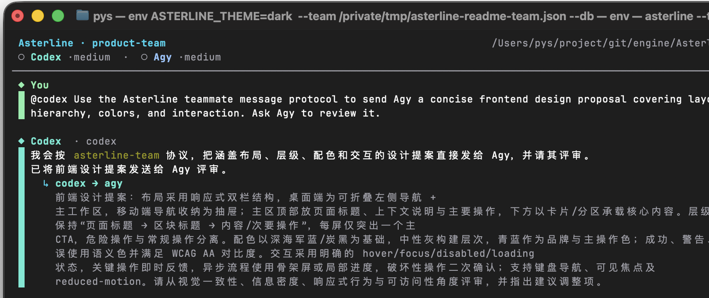
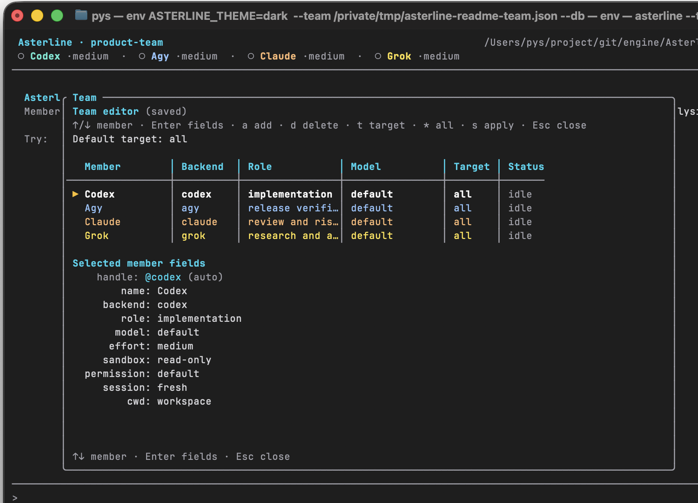

# Asterline

[English](README.md) · [简体中文](README.zh-CN.md)

[](https://github.com/song0705/Asterline/actions/workflows/ci.yml)
[](https://github.com/song0705/Asterline/releases/latest)
[](LICENSE)

**Turn local coding agents into one visible team.**

Asterline is a local-first terminal workspace for coordinating Codex, Claude,
Grok, and Agy. Instead of placing agents in disconnected tabs, it gives the
operator one shared conversation and the agents explicit roles, visible
handoffs, tracked runs, and a durable record of the work.

Asterline runs the official CLIs already installed on your machine. It is not a
model gateway, does not replace vendor authentication, and does not send your
workspace through an Asterline cloud service.

## At a glance

- **One terminal, one transcript:** member messages, reasoning, tools, diffs,
  errors, and handoffs remain visibly attributed.
- **Use the CLIs you already trust:** mix Codex, Claude, Grok, and Agy members;
  Asterline discovers installed models and reasoning-effort choices.
- **Five dispatch modes:** direct chat, review loops, owned plans, structured
  brainstorms with private voting, and coordinator-driven team execution.
- **Runs instead of loose turns:** checklists, owners, attempts, blockers,
  notes, verification, and next actions are persisted.
- **Local and resumable:** team configuration and operational history stay in
  the workspace by default; `/resume` restores a selected conversation and its
  native backend sessions.
- **Human-controlled:** approval gates, backend-native permissions, bounded
  relays, `/abort`, and visible logs keep the operator in the loop.



## Quick start

### Requirements

- Rust 1.85 or newer when building from source
- Linux or macOS and a terminal with color and alternate-screen support
- At least one installed and authenticated CLI: `codex`, `claude`, `grok`, or `agy`
- Git is recommended for diffs and verification commands

Prebuilt Windows binaries are not currently published.

### Install and launch

Download the archive for your platform from
[GitHub Releases](https://github.com/song0705/Asterline/releases/latest), then
install either binary from the extracted directory:

```bash
mkdir -p ~/.local/bin
install -m 755 ast ~/.local/bin/ast
ast --help
```

Release archives are published for Linux x86-64, Linux ARM64, macOS Intel, and
macOS Apple silicon. Every release includes `SHA256SUMS` and signed GitHub build
provenance.

To install from source instead, clone this repository and run:

```bash
cargo install --path . --force
cd ~/code/your-project
ast
```

This installs both `asterline` and the shorter `ast` command. Asterline detects
supported executables on `PATH`, opens the Team builder, and remembers the
result in `<workspace>/.asterline/team.json`.

If `ast` is not found after installing a release archive, add
`$HOME/.local/bin` to `PATH` and start a new shell. A source installation uses
Cargo's binary directory, normally `$HOME/.cargo/bin`.

In the Team builder:

1. Use `↑` and `↓` to select a member.
2. Press `Enter` to open that member's fields.
3. Use `↑` and `↓` to select a field; press `Enter` to edit it or open its
   choices.
4. Press `Esc` to return to member selection.
5. Press `s` to save and start.

The Agent field opens a list of all supported CLIs. Installed Agents are
selectable; unavailable ones remain visible and disabled. Asterline loads each
installed Agent's model and reasoning-effort capabilities automatically when
the builder opens. In the model list, use `↑`/`↓` for the model and `←`/`→`
for effort; `Enter` applies both. When discovery succeeds, Asterline shows and
selects the actual default model (or the first discovered model). `default`
appears only when no model can be discovered; fields read `loading…` while
automatic discovery is still running.

### First useful run

The examples below assume the roster contains a member with the `builder`
handle. Use the handle shown by your Team builder when it differs.

Send a direct task:

```text
@builder inspect this repository and identify the highest-risk code path
```

Run a review loop (the builder implements, the reviewer issues structured
verdicts until the work passes):

```text
/mode review
fix the payment callback race and add regression tests
```

Or have a leader plan an owned checklist that Asterline dispatches to the team:

```text
/mode plan
ship the payment callback fix end to end
```

Explore alternatives before committing to an implementation:

```text
/mode brainstorm
find three architectures for reducing index latency without weakening recall
```

Coordinate a complete multi-role delivery:

```text
/mode team
implement the selected design, review it, update the docs, and run verification
```

A fresh conversation requires an explicit target. Later plain text reuses the
previous target; `@all` and `/all` broadcast to the team.

To invoke a skill installed for a member CLI, type the member prefix followed
by `/`, for example `@codex /review-patch`. Asterline completes discovered
skills and passes the invocation to that member; Codex is translated to its
native `$review-patch` form. Unprefixed `/mode`, `/team`, and similar commands
remain Asterline commands.

## Why Asterline

### Coordination is the product

Many multi-agent terminal tools are session managers: they create panes,
worktrees, or parallel tasks and leave the operator to move context between
them. Asterline focuses on the collaboration layer:

- members have stable names, roles, models, permissions, and sessions;
- agents can hand work to named teammates inside the same visible conversation;
- tool calls, output, file changes, routes, and failures stay attributed;
- runs track ownership, attempts, blockers, notes, and verification;
- SQLite preserves the operational record across restarts.

### Use Asterline when

- implementation, review, research, and verification should be different roles;
- you already use supported coding CLIs and want them to collaborate;
- seeing why work moved between agents matters as much as the final patch;
- you want human-controlled collaboration without building an agent framework;
- local persistence and resumable sessions matter.

### Choose a different setup when

- every agent must work in an automatically isolated Git worktree or branch;
- you need a hosted agent service, web dashboard, or remote job queue;
- you need direct provider APIs rather than installed CLI subscriptions;
- you want fully unattended merge automation.

Asterline members share the configured workspace by default. A member may have a
different `cwd`, but Asterline does not currently create or merge worktrees.

## Supported backends

| Backend | Executable | Streaming                         | Resume | Model choices                 |
| ------- | ---------- | --------------------------------- | ------ | ----------------------------- |
| Codex   | `codex`    | `codex exec --json`               | Yes    | `codex debug models`          |
| Claude  | `claude`   | stream JSON with partial messages | Yes    | aliases and `availableModels` |
| Grok    | `grok`     | ACP over `grok agent stdio`       | Yes    | `grok models`                 |
| Agy     | `agy`      | `stream-json` print events        | Yes    | `agy models`                  |

Asterline does not install, authenticate, or bill for these products. Backend
availability, model access, and usage limits remain properties of the
underlying CLI account.

## How it works

```text
You
 └─ target a member, the whole team, or a tracked run
     ├─ Asterline launches/resumes the selected backend CLI
     ├─ stream events become chat, tools, diffs, logs, and session state
     ├─ valid teammate envelopes are routed to other members
     └─ messages, routes, run state, and verification persist to SQLite
```

Automatic teammate relays are bounded. When a turn reaches the configured
limit, Asterline pauses the route and exposes that state instead of allowing an
uncontrolled loop.

## Product experience

### One conversation

Each participant has a clear identity. Tool calls, returned output, diffs,
routes, and errors remain on the member's conversation rail. Failed tool output
is shown immediately; `Ctrl+O` expands or collapses longer successful output.

Agent Markdown, fenced code, tables, and working-tree diffs are rendered in the
terminal. Raw diagnostics remain available in `/logs` without flooding chat.

### A team you can change while it runs

Teams may mix backends or use the same backend more than once. Member
configuration can include a role, model, reasoning effort, working directory,
system prompt, sandbox, permission mode, tool allowlist, and session policy.
The exact settings passed through depend on the backend; the
[configuration reference](docs/configuration.md#backend-setting-support) lists
the current adapter behavior.

Open `/team` to update the live roster. Asterline immediately refreshes which
Agent CLIs are installed and preloads their model and reasoning-effort
capabilities in each member's working directory. The Agent field opens a
selectable list instead of cycling through backends; unavailable CLIs are
shown but cannot be selected. Press `e` on the model field to enter a custom
model, then `s` to apply and save changes.



### Collaboration modes with an audit trail

Select a mode first, then enter the task as the next message. The choice stays
with the current conversation until another `/mode` replaces it. `/new`
creates a conversation in normal mode; `/resume` restores the selected
conversation's mode.

| Mode         | Use it for                         | What Asterline does                                      |
| ------------ | ---------------------------------- | -------------------------------------------------------- |
| `normal`     | Direct work with one/all members   | Routes ordinary messages and remembers the last target   |
| `review`     | Implementation with a quality gate | Loops builder → structured reviewer verdict → revision   |
| `plan`       | Multi-step owned work              | Plans a checklist, dispatches owners, then reviews       |
| `brainstorm` | Broad exploration before judgment  | Runs seed/build/stretch, private vote, rank, synthesis   |
| `team`       | End-to-end coordinated delivery    | Lets a coordinator own steps, integrate, and verify      |

Review mode requires a structured `@@review` verdict. `approve` finishes the
run and can trigger verification; `request_changes` returns feedback to the
builder, bounded by `max_iterations`. Plan mode adds a leader-owned checklist
and dispatches its steps before the same review gate.

Brainstorm mode keeps divergence and judgment separate. Participants create
blind seeds, cross-pollinate from rotating anonymous peer samples, and stretch
the idea space through inversion, constraint removal, and analogy. Every idea
is retained in an append-only IdeaSet. Only after generation closes does each
participant privately rank stable candidate IDs. Asterline performs a
deterministic Borda tally and asks the synthesizer for a ranked top five,
recommended direction, alternative, and smallest useful experiment. A
workspace-local Brainstorm Skill defines the extractable card and ballot
schemas and can be customized for a deployment.

Who builds, reviews, plans, coordinates, or participates is configurable per
mode in `team.json`. `/runs`
shows the current conversation's mode phase, iteration budget, checklist
owners, verdict timeline, blockers, and the next suggested command. `/new`
starts with no runs; `/resume` restores the selected conversation's runs.

```text
/block waiting for the staging client secret
/note secret requested from the platform team
/continue secret is now available
/verify cargo test
```

Without an explicit verification command, Asterline detects common checks such
as `cargo test`, `npm test`, and `pytest`. Selecting `/mode team` sends
subsequent messages through the coordinator-driven team path; the coordinator
keeps a checklist, the run auto-verifies when they finish, and verify failures
auto-continue the coordinator until the iteration budget is exhausted.

### Conversation lifecycle

- `/new` persists the current conversation, starts fresh backend sessions,
  clears the visible transcript and run list, and selects normal mode.
- `/resume` opens a picker rather than guessing which history to restore. The
  selected transcript, roster, member settings, native session IDs, mode, and
  runs return together.
- `/runs` is conversation-scoped: a new chat starts empty, while a resumed chat
  shows only the runs that belong to it.
- `--no-restore` skips automatic replay at startup without deleting saved
  conversations.

### Native session attach

Focus a member with `Ctrl+N` or `Ctrl+B`, move with `←` or `→`, and press
`Enter`. Asterline suspends its interface and opens that member's native
interactive CLI, resuming its session when possible. Exit the CLI to return.

Codex and Claude messages created while attached are imported into the
Asterline transcript. Grok and Agy resume their native session but do not
import the attached transcript.

To bind a member to an existing native CLI conversation, open `/team`, select
the member and press `Enter` on `session id`. Asterline extracts local Codex,
Claude, and Grok history metadata for that member's working directory into its
own searchable session table; choose a row with `↑`/`↓` and `Enter`, then press
`s` to apply. Press `e` for manual entry (required for Agy), or enter `default`
to remove an explicit binding. The selected ID is persisted in `team.json` and
passed to the backend's native resume command.

### Local, durable state

By default, Asterline stores the roster and SQLite database inside the project:

```text
<workspace>/.asterline/
├── team.json
└── asterline.sqlite3
```

The database contains prompts, responses, tool events, routes, raw backend
events, logs, approvals, sessions, and run history. Treat it as sensitive
development data and normally add this to the project `.gitignore`:

```gitignore
.asterline/
```

Asterline creates `.agents/skills/asterline-team/SKILL.md` for team controls and
`.agents/skills/asterline-brainstorm/SKILL.md` for idea-card, voting, and
synthesis policy. The brainstorm skill is installed only when missing and is
never overwritten, so each deployment can customize its method while
preserving the structured card and ballot schemas. These are workspace
integration files rather than runtime history; review them and decide whether
your project should version them.

## Essential commands

| Command                | Purpose                                       |
| ---------------------- | --------------------------------------------- |
| `@<member> <message>`  | Send to one member                            |
| `@all <message>`       | Broadcast to the team                         |
| `/mode`                | Choose normal or a collaboration mode         |
| `/runs`                | Inspect run state, phase, and next actions    |
| `/team`                | Edit the live roster                          |
| `/skills`              | Select a Skill for the next prompt            |
| `/find <text>`         | Search the transcript                         |
| `/diff`                | Inspect unstaged changes and untracked files  |
| `/logs`                | Open persisted diagnostics                    |
| `/new`                 | Start a new conversation and backend sessions |
| `/resume`              | Choose and restore a saved team conversation  |
| `/approve` / `/reject` | Resolve a pending approval                    |
| `/retry`               | Re-send the most recent user request          |
| `/abort`               | Cancel running work, modes, and verification  |
| `/help`                | Open the command palette                      |

See the [complete command and keyboard reference](docs/commands.md) for run
step commands, Team controls, prompt history, session attach, and `/runs`
navigation.

## Permissions and safety

Asterline launches backend processes locally and inherits their credentials,
environment, filesystem access, and network access. It does not sandbox a
process beyond the controls supported by that backend.

Members may use backend-native sandbox and permission settings. Asterline also
gates requests it classifies as risky — user messages, agent-to-agent relays,
and collaboration-mode dispatches — with a configurable policy (see
[approvals and tool-level control](docs/approvals.md)). `--debug` disables the
Asterline approval gate and is intended only for controlled development
environments.

Read [configuration and operations](docs/configuration.md) before using
`danger-full-access`, bypass-style permission modes, custom system prompts, or
agent-managed roster changes.

## Common questions

### Does Asterline upload my repository?

No Asterline cloud service receives the workspace. Asterline launches local
backend CLI processes; those CLIs keep their own vendor authentication, network
behavior, data policy, and billing.

### Why does a new chat ask for `@member`?

Normal mode deliberately requires an explicit first target. Use `@builder`,
`@all`, `/ask`, or `/all`. Later plain text can reuse that target. A selected
collaboration mode accepts a plain task because its participants come from the
mode configuration.

### Why did the previous mode disappear—or remain?

`/mode` belongs to a conversation. `/new` creates a new conversation in
`normal`; `/resume` restores the selected conversation's saved mode.

### Is `/clear` supported?

There is no history-hiding `/clear` command. Typing `/cl` or `/clear` offers
`/new` in completion, which preserves the old conversation and starts a clean
one.

### Why does the model field show `loading…` or `default`?

`loading…` means automatic model discovery is still running. `default` appears
only when discovery returns no model. Check that the selected backend is
installed, authenticated, and able to list models in that member's working
directory; press `e` to enter a model manually.

### Where should I look when agent output seems incomplete?

Open `/logs` for raw backend stderr and adapter warnings, `/focus <member>` for
one member, and `/runs` for run phase and blockers. `/diff` shows the actual
working-tree result independently of the chat presentation.

## Documentation

- [Commands and keyboard](docs/commands.md)
- [Configuration, local data, permissions, and troubleshooting](docs/configuration.md)
- [Approval layers and tool-level control](docs/approvals.md)
- [v0.2.0 release notes](docs/releases/v0.2.0.md)
- Built-in command palette: `/help`
- Command-line help: `asterline --help`

## Development

Run against offline fake agents:

```bash
cargo run -- --fake
```

Run the full local quality gate:

```bash
cargo fmt --check
cargo clippy --all-targets -- -D warnings
cargo test
```

If `just` is installed, `just run --fake`, `just install`, and `just check`
provide the same common development commands.

```text
src/
├── adapter/   backend streams, model discovery, PTY and process adapters
├── domain/    team configuration and structured events
├── router/    teammate envelopes, targets, and relay limits
├── runtime/   orchestration, approvals, sessions, and runs
├── store/     SQLite persistence and replay
├── tui/       chat, composer, drawers, commands, and Team editor
└── app.rs     CLI bootstrap and product wiring
```

## Project status

Asterline is currently version `0.2.0` and under active development. Tagged
versions are published as prebuilt Linux and macOS archives through GitHub
Actions. Before a stable release, configuration, persisted data, commands, and
UI details may change without backward compatibility.

Release maintainers should follow the [release guide](docs/releasing.md).

## Feedback and contributions

Use [GitHub Issues](https://github.com/song0705/Asterline/issues) for
reproducible bugs and feature proposals. Include the operating system,
terminal, Asterline version, backend CLI and version, relevant `/logs` output,
and the smallest sequence that reproduces the problem. Remove credentials,
prompts, source code, and session IDs that should not be public.

Before submitting a change, run `just check` or the three quality-gate commands
shown above. Real backend smoke tests are opt-in and are not run by default.

## License

Asterline is available under the [MIT License](LICENSE).
