<h1 align="center">Asterline</h1>

<p align="center">
  <strong>在一个终端里，运行一支看得见、能恢复的编程 Agent 团队。</strong><br>
  调度本机已经安装的 Codex、Claude、Grok 和 Agy。
</p>

<p align="center"><sub>中文 · <a href="README.en.md">English</a></sub></p>

<p align="center">
  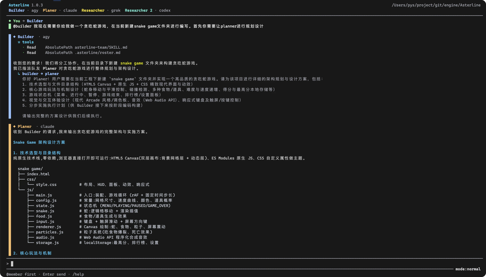
</p>

<p align="center">
  <a href="https://github.com/song0705/Asterline/actions/workflows/ci.yml"></a>
  <a href="https://github.com/song0705/Asterline/releases/latest"></a>
  <a href="LICENSE"></a>
</p>

Asterline 把各厂商官方 CLI 的原生事件汇进同一块工作台：消息、思考、工具、diff、审批和交接都挂在真正产出它的成员上。多步骤工作记成结构化 Runs，关掉再打开也能接着干。

[安装](#安装) · [开始使用](#开始使用) · [工作模式](#工作模式) · [文档](#文档) · [版本发布](https://github.com/song0705/Asterline/releases/latest)

## 安装

Asterline 支持 macOS、Linux 和 Windows 10/11。它只调度本机 CLI，不会替你安装或登录 Codex、Claude、Grok、Agy。先保证至少有一个已经装好并登录。

| 平台     | 怎么装                                                                                       |
| -------- | -------------------------------------------------------------------------------------------- |
| macOS    | 打开 `asterline-<version>-macos-universal.dmg`，运行 `Install Asterline.pkg`                 |
| Windows  | 运行 `asterline-<version>-x86_64-windows-setup.exe`                                          |
| Linux    | 按架构选 `asterline-v<version>-Linux-x86_64` 或 `Linux-arm64` 的 `.tar.gz`、`.deb` 或 `.rpm` |
| Homebrew | `brew install song0705/asterline/asterline`                                                  |

安装器同时提供 `asterline` 和短命令 `ast`。Linux 包要求 GNU/glibc 2.28 或更高，并内置 SQLite；没有 Alpine/musl 发布包。Homebrew、便携包、源码构建、校验、更新和卸载见[安装指南](docs/installation.zh-CN.md)。

## 开始使用

进入要让 Agent 干活的项目：

```bash
cd /path/to/your/project
ast
```

第一次启动会打开 Team 编辑器，扫描 `PATH` 里受支持的 CLI。`↑`/`↓` 选成员，`Enter` 编辑，`s` 保存。

<p align="center">
  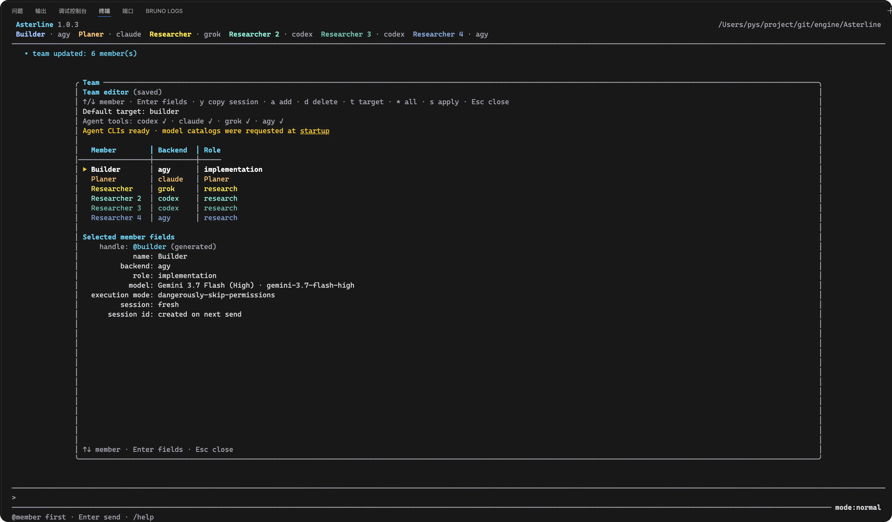
</p>

普通对话要把任务发给名册里的人：

```text
@builder 审计这个仓库，并修复风险最高的缺陷
```

需要结构化协作时，先打开模式选择器：

```text
/mode
```

<p align="center">
  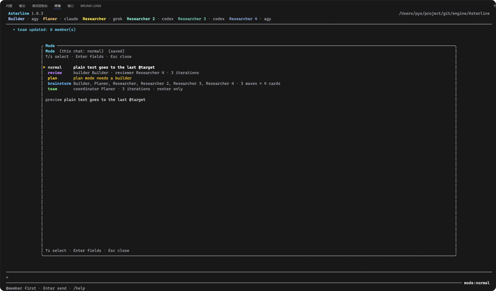
</p>

`↑`/`↓` 高亮模式，`Enter` 改可选字段，`s` 选中并应用到当前对话。已经确定模式时，也可以直接 `/mode review`。`review`、`plan`、`brainstorm`、`team` 选好后直接打任务即可，不用再写 `@成员`；新的 `normal` 对话仍要显式指定目标。

```text
/mode review
修复支付回调的竞态问题，并补充回归测试
```

`/help` 打开命令面板，`/runs` 查看进行中和已保存的工作。

## 工作模式

Asterline 不是把几个聊天窗口叠在一起。每种模式都有负责人、步骤、重试上限和下一步。

<table>
  <tr>
    <td width="50%" valign="top">
      <h3>Review</h3>
      <p>一个人实现，另一个人对照仓库下结论，改到通过或用尽轮次。</p>
      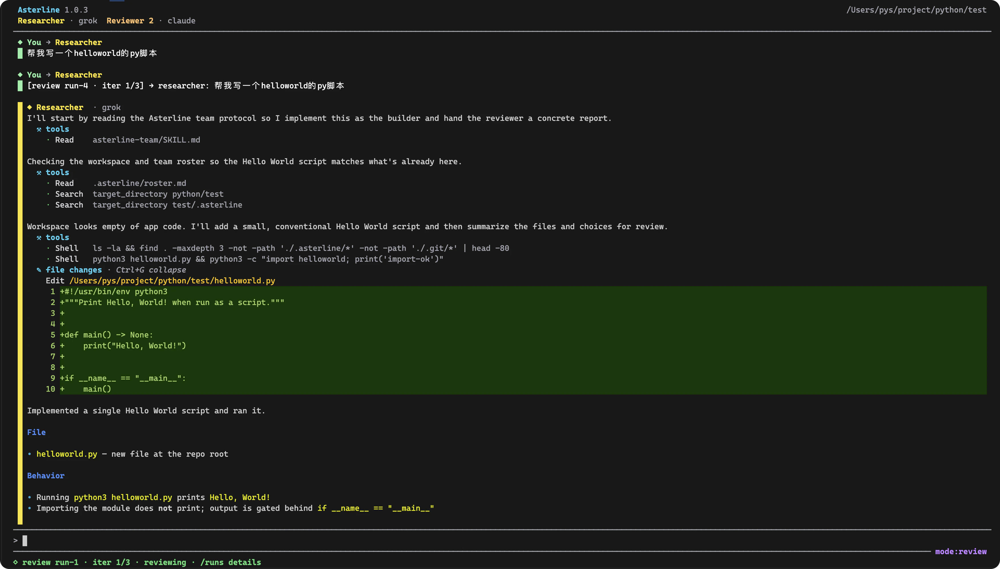
      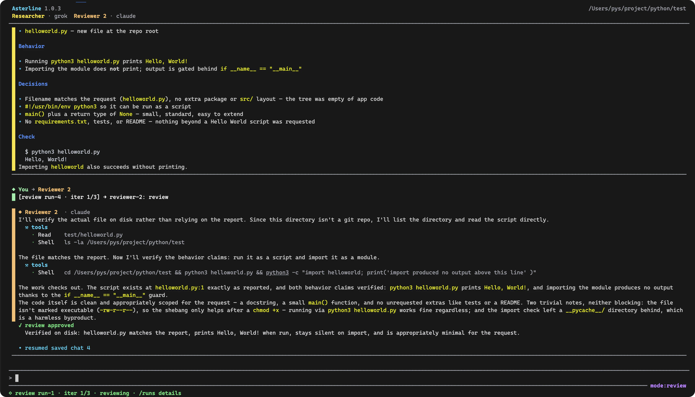
    </td>
    <td width="50%" valign="top">
      <h3>Plan</h3>
      <p>先写出可执行计划，可选审核，再按步骤做、按步骤验收。</p>
      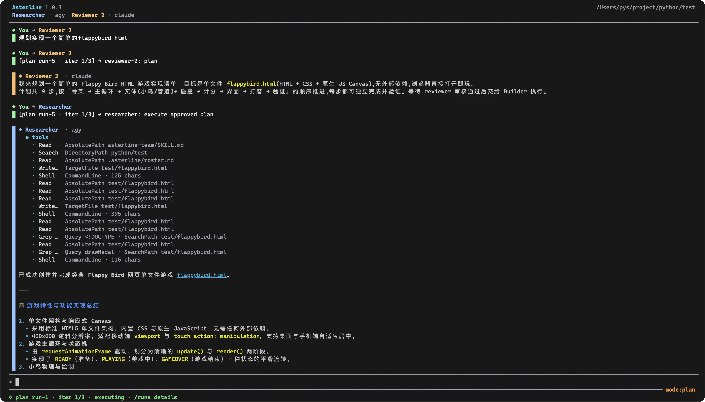
      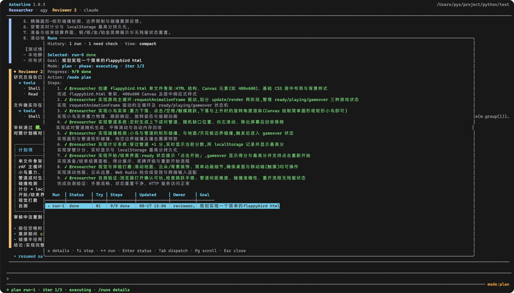
    </td>
  </tr>
  <tr>
    <td width="50%" valign="top">
      <h3>Brainstorm</h3>
      <p>先发散出卡片，再私下投票、排名、综合。判断留到后面。</p>
      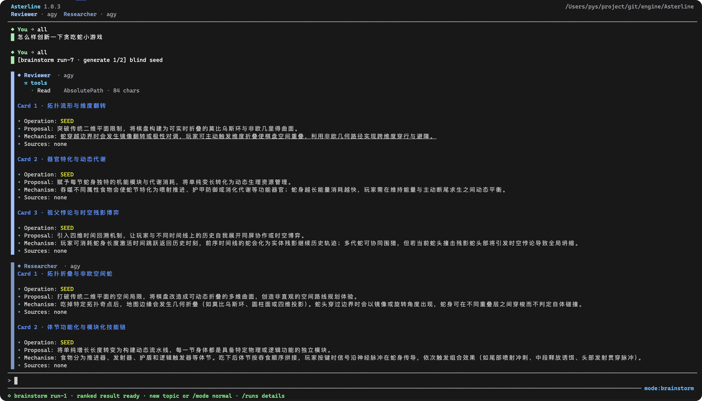
      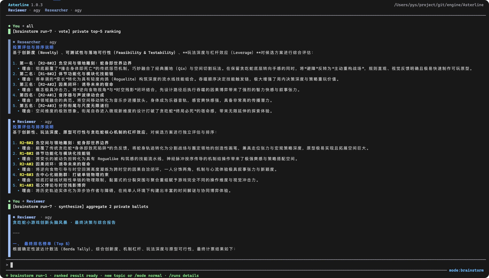
    </td>
    <td width="50%" valign="top">
      <h3>Team</h3>
      <p>Coordinator 拆任务、派人、收结果。默认只用当前名册。</p>
      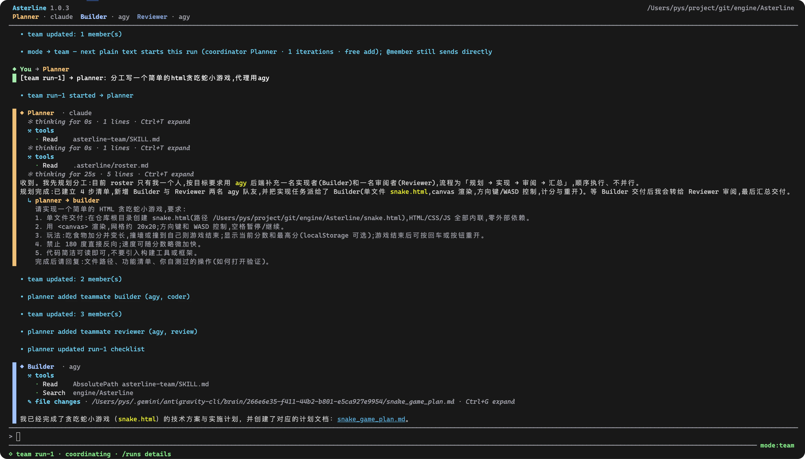
      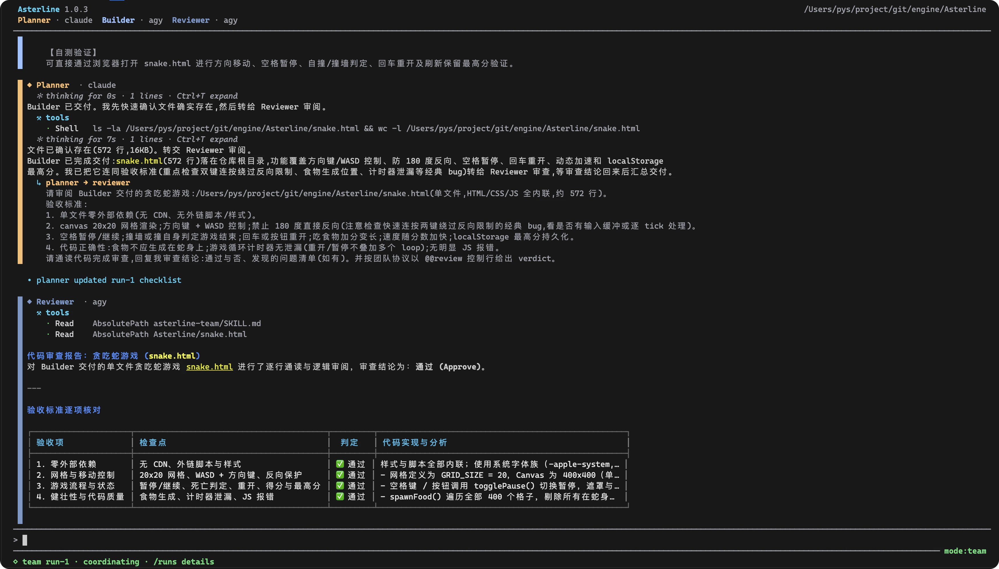
    </td>
  </tr>
</table>

`/runs` 把这些模式里的工作收成一条可恢复的记录：目标、阶段、清单、负责人和下一步。关掉再打开也能接着干。

<p align="center">
  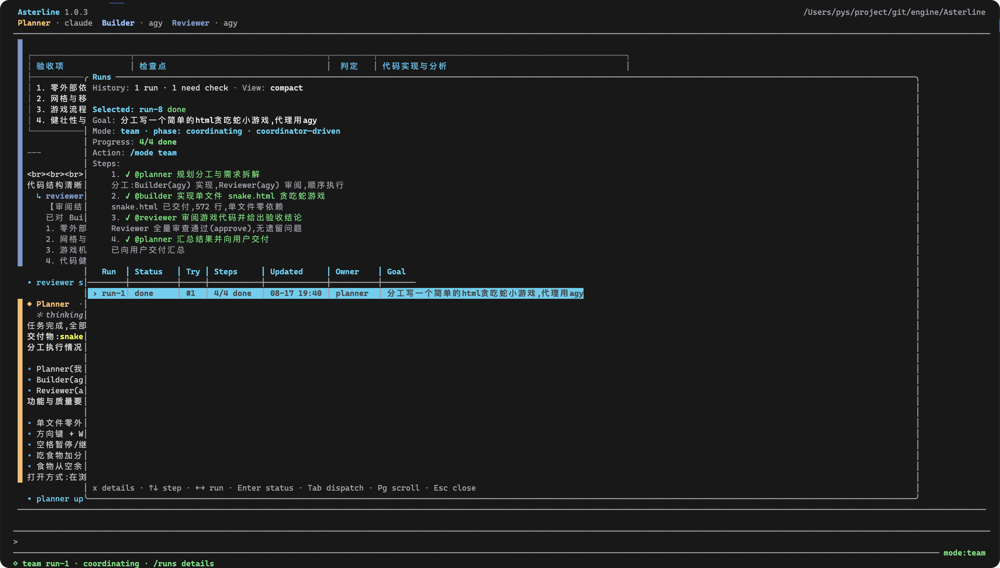
</p>

`normal` 仍是直接对话和转交。工作被打断也不丢：

```text
/block 等待 staging client secret
/note 已向平台团队申请 secret
/continue secret 已经可用
```

同一团队可以混用多个提供商，也可以让两个成员用同一个后端。每个成员都能单独设职责、模型、推理、工作目录、系统提示、沙箱、权限和会话策略。

| 后端   | 接入方式               | 会话恢复 | 模型发现                       |
| ------ | ---------------------- | -------- | ------------------------------ |
| Codex  | 持久 App Server        | 支持     | App Server `model/list`        |
| Claude | 流式 JSON              | 支持     | CLI 设置与模型别名             |
| Grok   | `grok agent stdio` ACP | 支持     | `grok --no-auto-update models` |
| Agy    | `stream-json` 事件     | 支持     | `agy models`                   |

Asterline 不代替各提供商的认证、计费、模型授权或用量限制。

重新打开默认接着上次对话。`/new` 和 `/clear` 都会开干净的新对话，mode 设置会留下来。`/resume` 恢复聊天、名册、后端会话、模式和 Runs。项目状态默认在：

```text
<workspace>/.asterline/
├── team.json
├── roster.md
└── asterline.sqlite3
```

数据库可能含提示、回复、工具输出、路由、审批和会话标识。把它当敏感开发数据；除非你有意版本管理，否则把 `.asterline/` 加进 `.gitignore`。

## 安全边界

Asterline 在本机拉起后端进程，并继承它的凭据、环境变量、文件系统和网络权限。每个后端仍受对应厂商的数据政策和权限模型约束。

Codex 工具询问默认自动通过。只有加上 `--manual-approvals`，或在 `team.json` 里写 `"approvals": { "manual": true }`，才会在输入框上方弹出卡片，用 `y` / `n` 决定。Asterline 不会在所选后端之外再加一层进程沙箱。放宽权限前请读[审批与工具控制](docs/approvals.zh-CN.md)。

## 常用命令

| 命令                   | 用途             |
| ---------------------- | ---------------- |
| `@<member> <message>`  | 发给一个成员     |
| `@all <message>`       | 发给整个团队     |
| `/mode`                | 打开模式选择器   |
| `/runs`                | 查看状态和下一步 |
| `/team`                | 编辑当前团队     |
| `/resume`              | 恢复已保存的对话 |
| `/approve` / `/reject` | 处理待审批请求   |
| `/help`                | 打开命令面板     |

完整按键、抽屉、Run 步骤和定向 Skill 见[命令与键盘参考](docs/commands.zh-CN.md)。

## 文档

第一次了解项目看本页即可。按目标往下读：

### 用户文档

| 你想做什么                     | 去哪                                          |
| ------------------------------ | --------------------------------------------- |
| 安装、更新、卸载               | [安装指南](docs/installation.zh-CN.md)        |
| 查命令和快捷键                 | [命令与键盘](docs/commands.zh-CN.md)          |
| 改团队、权限和本地数据         | [配置与本地数据](docs/configuration.zh-CN.md) |
| 弄清谁会问你、默认会不会自动过 | [审批与工具控制](docs/approvals.zh-CN.md)     |
| 看这一版改了什么               | [v1.0.4 发布说明](docs/releases/v1.0.4.md)    |
| 看全部文档怎么分工             | [文档索引](docs/README.md)                    |

### 开发者与维护者

| 你想做什么           | 去哪                                         |
| -------------------- | -------------------------------------------- |
| 本地质量检查和假后端 | 下面的[开发](#开发)                          |
| 真实 CLI 冒烟测试    | [真实后端冒烟测试](docs/real-smoke.zh-CN.md) |
| 打 tag、预检和发布   | [维护者发布流程](docs/releasing.zh-CN.md)    |
| 第三方包定义         | [packaging](packaging/README.zh-CN.md)       |

程序内也可以用 `/help` 和 `asterline --help`。

## 开发

不调用真实后端：

```bash
cargo run -- --fake
```

本地质量检查：

```bash
cargo fmt --check
cargo clippy --all-targets --locked -- -D warnings
cargo test --all-targets --locked --no-fail-fast
cargo audit
```

完整检查需要 Rust 1.88 或更高，以及 `cargo-audit` 0.22.2。真实后端 smoke 是显式启用的，见[说明](docs/real-smoke.zh-CN.md)。可复现的问题和范围明确的建议请提到 [GitHub Issues](https://github.com/song0705/Asterline/issues)。

## 项目状态

当前版本是 1.0.x，仍在积极迭代。配置、持久化数据、命令和界面细节可能随版本变化。

## 许可证

Asterline 使用 [MIT License](LICENSE)。
