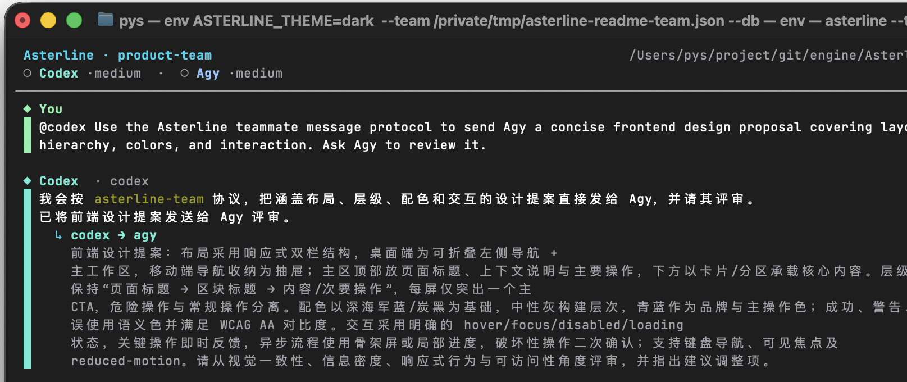
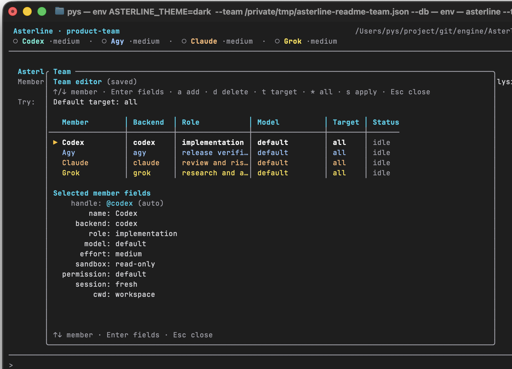

# Asterline

[English](README.md) · [简体中文](README.zh-CN.md)

**让本地编程 Agent 真正成为一支看得见的团队。**

Asterline 是一个本地优先的终端协作工作台，用于统一调度 Codex、Claude、Grok
和 Agy。它不只是把多个 Agent 放进不同窗口，而是提供一段共享对话、明确的成员
职责、可见的任务交接、可追踪的工作流，以及一份持久保存的执行记录。

Asterline 直接运行你电脑上已经安装的官方 CLI。它不是模型网关，不代替各厂商的
登录认证，也不会把工作区上传到 Asterline 云服务。



## 快速开始

### 环境要求

- Rust 1.85 或更高版本
- 支持颜色和备用屏幕的终端
- 至少安装并登录一个 CLI：`codex`、`claude`、`grok` 或 `agy`
- 推荐安装 Git，以便查看差异和运行验证流程

### 安装并启动

克隆本仓库后执行：

```bash
cargo install --path . --force
cd ~/code/your-project
ast
```

安装会同时提供 `asterline` 和更短的 `ast` 命令。Asterline 会检测 `PATH` 中可用的
后端，打开 Team 编辑器，并将结果保存在
`<workspace>/.asterline/team.json`。

在 Team 编辑器中：

1. 使用 `↑`、`↓` 选择成员。
2. 按 `Enter` 进入该成员的字段列表。
3. 使用 `↑`、`↓` 选择字段，按 `Enter` 编辑、切换或打开选项。
4. 按 `Esc` 返回成员选择。
5. 按 `s` 应用、保存并启动团队。

### 第一个协作任务

下面假设团队中有一个 handle 为 `builder` 的成员；如果你的 Team 编辑器显示了
其他 handle，请替换它。

直接派发任务：

```text
@builder 检查这个仓库，并找出风险最高的代码路径
```

或者启动一个可追踪的团队工作流：

```text
/plan 修复支付回调的竞态问题，补充回归测试，再让 reviewer 完成审查
```

新对话的第一条消息必须明确目标成员。之后的普通文本会继续发给上一次目标；
`@all` 和 `/all` 会广播给整个团队。

## 为什么是 Asterline

### 协作本身就是产品

不少多 Agent 终端工具本质上是会话管理器：创建窗格、工作树或并行任务，然后把
上下文搬运留给使用者。Asterline 聚焦的是协作层：

- 每个成员拥有稳定的名称、职责、模型、权限和会话；
- Agent 可以在同一段可见对话中把工作交给指定队友；
- 工具调用、输出、文件变更、路由和失败都有明确归属；
- 工作流持续记录负责人、尝试次数、阻塞、备注和验证结果；
- SQLite 在重启后仍保留完整操作记录。

### 适合这些场景

- 希望实现、审查、研究和验证由不同角色承担；
- 已经在使用受支持的编程 CLI，希望它们协同工作；
- 除了最终补丁，还需要知道工作为何在成员之间流转；
- 需要由人掌控的协作流程，又不想自己搭 Agent 框架；
- 重视本地存储和可恢复的后端会话。

### 这些需求应选择其他方案

- 每个 Agent 都必须自动拥有隔离的 Git worktree 或分支；
- 需要托管式 Agent 服务、网页控制台或远程任务队列；
- 需要直接调用模型厂商 API，而不是本机 CLI 订阅；
- 需要无人值守的自动合并流水线。

Asterline 成员默认共享同一个工作区。可以为成员设置不同的 `cwd`，但当前版本
不会自动创建或合并 worktree。

## 支持的后端

| 后端   | 可执行文件 | 流式接口                | 会话恢复 | 模型来源                 |
| ------ | ---------- | ----------------------- | -------- | ------------------------ |
| Codex  | `codex`    | `codex exec --json`     | 支持     | `codex debug models`     |
| Claude | `claude`   | 带增量消息的流式 JSON   | 支持     | 别名与 `availableModels` |
| Grok   | `grok`     | 官方 headless 流式 JSON | 支持     | `grok models`            |
| Agy    | `agy`      | print/log 流            | 支持     | `agy models`             |

Asterline 不负责安装、认证或计费。后端是否可用、能访问哪些模型、以及使用额度，均由
对应 CLI 账号决定。

## 工作方式

```text
你
 └─ 指定一个成员、整个团队或一个工作流
     ├─ Asterline 启动或恢复对应的后端 CLI
     ├─ 将流事件转换为对话、工具、差异、日志和会话状态
     ├─ 把合法的队友消息路由给其他成员
     └─ 将消息、路由、工作流和验证结果持久化到 SQLite
```

自动转交有明确上限。一次任务达到配置的转交次数后，Asterline 会暂停路由并等待
`/retry`，避免 Agent 之间出现失控循环。

## 产品体验

### 一段统一的对话

每个参与者都有清晰身份。工具调用、返回结果、diff、交接和错误始终位于对应成员的
对话轨道上。失败的工具输出会立即展示；较长的成功输出可用 `Ctrl+O` 展开或折叠。

Agent 返回的 Markdown、代码块、表格和工作区差异会直接在终端中渲染。原始诊断
信息保存在 `/logs` 中，不会淹没主对话。

后端身份色分别针对深色和浅色终端优化。自动判断不准确时，可使用
`ASTERLINE_THEME=dark` 或 `ASTERLINE_THEME=light` 强制选择；成员名称、后端标签
和连续对话轨道也会同时标识身份，不会只靠颜色区分。

### 运行中也能调整团队

一个团队可以混用不同后端，也可以多次使用同一后端。成员可配置职责、模型、推理
强度、工作目录、系统提示、沙箱、权限模式、工具白名单和会话策略。各后端实际支持
的字段不同，详见[配置参考](docs/configuration.md#backend-setting-support)。

输入 `/team` 即可修改当前团队。模型选项会在该成员的工作目录中自动发现；在模型
字段按 `e` 可以手动输入。按 `s` 应用并保存变更。



### 带审计记录的工作流

`/plan` 创建的是可追踪的 run，而不是一条无法管理的普通消息。`/runs` 会显示步骤
负责人、进度、尝试次数、近期事件、阻塞、验证结果和下一条建议命令。

```text
/block 等待 staging client secret
/note 已向平台团队申请 secret
/continue secret 已经可用
/verify cargo test
```

没有指定验证命令时，Asterline 会自动识别 `cargo test`、`npm test`、`pytest` 等
常见检查。

### 原生会话接入

使用 `Ctrl+N` 或 `Ctrl+B` 聚焦成员，按 `←`、`→` 移动，再按 `Enter`。Asterline
会暂时挂起界面，打开该成员的原生交互式 CLI，并尽可能恢复已有会话。退出 CLI 后
即可回到 Asterline。

接入期间产生的 Codex 消息会导入 Asterline 对话记录。其他后端当前会恢复原生会话，
但不会导入接入期间的消息。

### 本地、持久、可检查

默认情况下，团队配置和 SQLite 数据库保存在项目内：

```text
<workspace>/.asterline/
├── team.json
└── asterline.sqlite3
```

数据库包含提示、回复、工具事件、成员路由、原始后端事件、日志、审批、会话和工作流
历史。这些都是敏感开发数据，通常应加入 `.gitignore`：

```gitignore
.asterline/
```

如果团队协议不存在，Asterline 还会创建
`.agents/skills/asterline-team/SKILL.md`。它是可读的工作区集成文件，不是运行
历史；请自行审查并决定是否纳入版本控制。

## 常用命令

| 命令                   | 用途                       |
| ---------------------- | -------------------------- |
| `@<member> <message>`  | 向一个成员发送消息         |
| `@all <message>`       | 向全队广播                 |
| `/plan <goal>`         | 启动可追踪的团队工作流     |
| `/runs`                | 查看工作流状态和下一步操作 |
| `/team`                | 编辑当前团队               |
| `/skills`              | 为下一条提示选择 Skill     |
| `/diff`                | 查看未暂存修改和未跟踪文件 |
| `/logs`                | 打开持久化诊断日志         |
| `/new`                 | 创建新对话和新的后端会话   |
| `/approve` / `/reject` | 处理待审批请求             |
| `/retry`               | 恢复暂停的路由或重试上一轮 |
| `/abort`               | 取消正在运行的任务和验证   |
| `/help`                | 打开命令面板               |

完整的工作流步骤命令、Team 操作、提示历史、原生会话接入和 `/runs` 导航，请查看
[命令与键盘参考](docs/commands.md)。

## 权限与安全

Asterline 在本机启动后端进程，并继承其凭据、环境变量、文件系统访问和网络访问。
除了后端自身支持的控制，Asterline 不会额外提供进程级沙箱。

成员可以使用后端原生的沙箱和权限设置。Asterline 还会拦截其判定为高风险的请求。
`--debug` 会关闭 Asterline 审批门，仅适合受控的开发环境。

使用 `danger-full-access`、绕过式权限模式、自定义系统提示或允许 Agent 管理团队前，
请先阅读[配置与运维参考](docs/configuration.md)。

## 文档

- [命令与键盘参考](docs/commands.md)
- [配置、本地数据、权限与故障排查](docs/configuration.md)
- 内置命令面板：`/help`
- 命令行帮助：`asterline --help`

目前详细参考文档以英文提供；中文 README 覆盖安装、核心能力与日常使用路径。

## 开发

使用离线 Fake Agent 运行：

```bash
cargo run -- --fake
```

运行完整本地质量检查：

```bash
cargo fmt --check
cargo clippy --all-targets -- -D warnings
cargo test
```

如果已安装 `just`，也可以使用 `just run --fake`、`just install` 和 `just check`。

```text
src/
├── adapter/   后端事件流、模型发现、PTY 和进程适配器
├── domain/    团队配置与结构化事件
├── router/    队友消息、目标和转交上限
├── runtime/   调度、审批、会话和工作流
├── store/     SQLite 持久化与重放
├── tui/       对话、输入框、抽屉、命令和 Team 编辑器
└── app.rs     CLI 启动与产品装配
```

## 项目状态

Asterline 当前版本为 `0.1.0`，仍在积极开发。当前通过源码安装，尚未发布预编译版本
和正式支持平台矩阵。配置与持久化数据会尽可能迁移，但在稳定版之前，命令和界面
细节仍可能变化。
